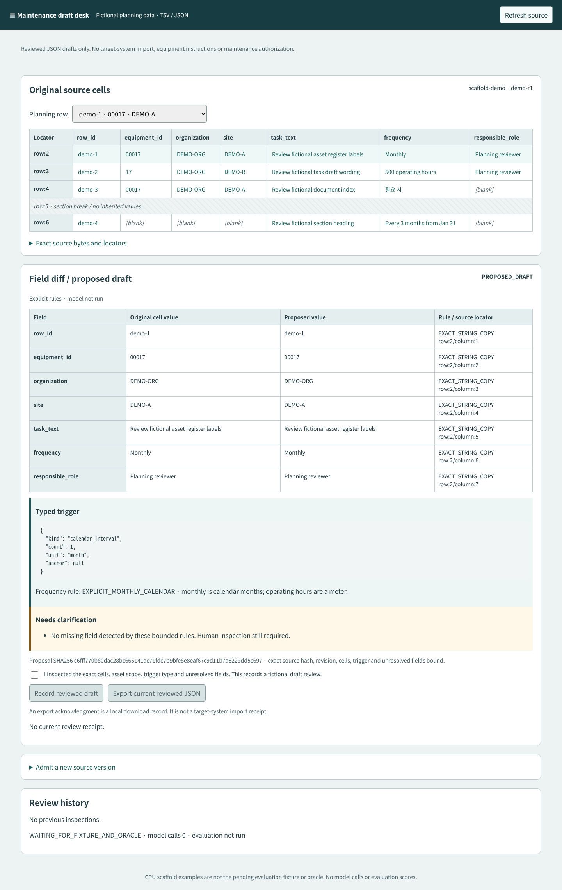

# Maintenance job-plan draft desk


[Editable SVG](docs/architecture.svg) · [Asset provenance](docs/asset-provenance.md)

A CPU scaffold for reviewing fictional spreadsheet rows as structured maintenance planning drafts. The native source-cell grid preserves original wording and locators; the field comparison separates copied identities from typed calendar, meter and event interpretations. It ends at reviewed JSON, with no Maximo credentials, integration or maintenance authorization.

**Fixture/oracle packet pending. Evaluation has not run. Model calls: 0.** The four rows in `scaffold/example.tsv` are implementation examples authored for this scaffold, not the independent evaluation dataset. Unit regressions are engineering checks, not measured extraction accuracy.



[CPU-only scaffold demonstration](artifacts/media/scaffold-review.mp4) · [390px source grid](artifacts/media/scaffold-mobile-390.png) · [Actual browser checks](artifacts/scaffold-browser-checks.json) · [Independent engineering review](docs/review.md)

29 Node engineering tests pass. Browser checks verify exact cell navigation, repeated immutable receipts, stale two-client rejection, retained conflicts, historical review, local-only export and a 390px document width with scrollable tables and text at least 14px. [Development failures](artifacts/scaffold-browser-failures.json) and [video provenance](artifacts/scaffold-video-provenance.json) remain separate from the pending fixture evaluation. Automated demo inspections are not independent human domain adjudication.

## Run

Node 20 or later; no dependencies:

```sh
npm test
npm start
```

Open `http://127.0.0.1:5089`. All source state is fictional and in memory. Original source versions remain immutable when a new version is admitted. The optional model protocol will be declared and frozen only after the fixture/oracle contract arrives; no model API exists in this scaffold.

## Input and decision boundaries

TSV uses literal tab-delimited string cells, with no CSV quoting or merged-cell interpretation. JSON uses a `rows` array of string-valued objects. Duplicate JSON keys and numeric identifiers are rejected as invalid input. Namespace, source ID/revision, raw UTF-8 text hash, row/cell locator, lexical span, organization/site and equipment identity bind the proposal. JSON lexical quotes/escapes remain distinct from decoded cell text. Spans state both UTF-16 code-unit offsets and UTF-8 byte offsets. Paste input is hashed as supplied UTF-8 text; raw binary workbook uploads are not supported.

`00017` and `17` remain different strings. Blank or missing cells remain unresolved, including after a section break. A role is a role label, not a named person or authorization. Formulas and links are inert data: no macros, formula execution or URL following.

The small explicit grammar preserves monthly calendar units, operating-hour meter units, ordinal weekday rules and an explicit whichever-first combination. It never converts monthly to 30 days or operating hours to wall-clock time. Anchored month intervals retain the source anchor and require its interpretation/month-end convention; Jan 31 plus three months does not silently become a calculated date. `필요 시` has an unspecified event requiring clarification. Unsupported clauses stay unresolved; this is not a complete multilingual maintenance parser.

Same namespace/row ID/revision with differing values produces a conflict and blocks draft acceptance. This scaffold uses one declared source revision; an optional row-level source_revision must agree with it, otherwise input is rejected as ambiguous. A deliberate new-source-revision admission archives the old revision without asserting vendor chronology. Same-revision differing versions remain admitted together for conflict detection. A receipt binds the exact proposal, source hash/revision, typed trigger, scope and unresolved fields. Changed source or proposal requires fresh inspection; no automatic re-acceptance. A reviewed draft can explicitly retain unresolved fields, with `REVIEWED_WITH_UNRESOLVED_FIELDS` status. It is not a complete executable plan.

Client reads and mutations serialize, with server-version and exact proposal guards. Local export acknowledgment has a null target import receipt. Historical review hashes are retained; they cannot authorize changed trigger or asset scope.

## Business precedent and limits

IBM's named [Quant Service case](https://www.ibm.com/fr-fr/case-studies/quant-service) describes an MVP converting spreadsheet attachments into structured job-plan data through human validation/correction. It reports 65% less manual work and 30% faster CMMS implementation without a disclosed controlled denominator. P09 does not measure or claim those benefits, and the case is not evidence of a full rollout or this prototype's performance.

The requested [master PM documentation](https://www.ibm.com/docs/en/masv-and-l/maximo-manage/cd?topic=pm-master-preventive-maintenance-records) and [job-plan/work-order documentation](https://www.ibm.com/docs/en/masv-and-l/maximo-manage/cd?topic=overview-job-plans-work-orders) returned HTTP 403 during this research pass. Their current text was not verified. The stated project contract independently limits P09 to an original reviewed draft; no work order, PM record, target-system import or actual maintenance action is created.

Original code, glyphs and scaffold examples are MIT. Independent fixture licenses/provenance will be preserved separately when supplied.
