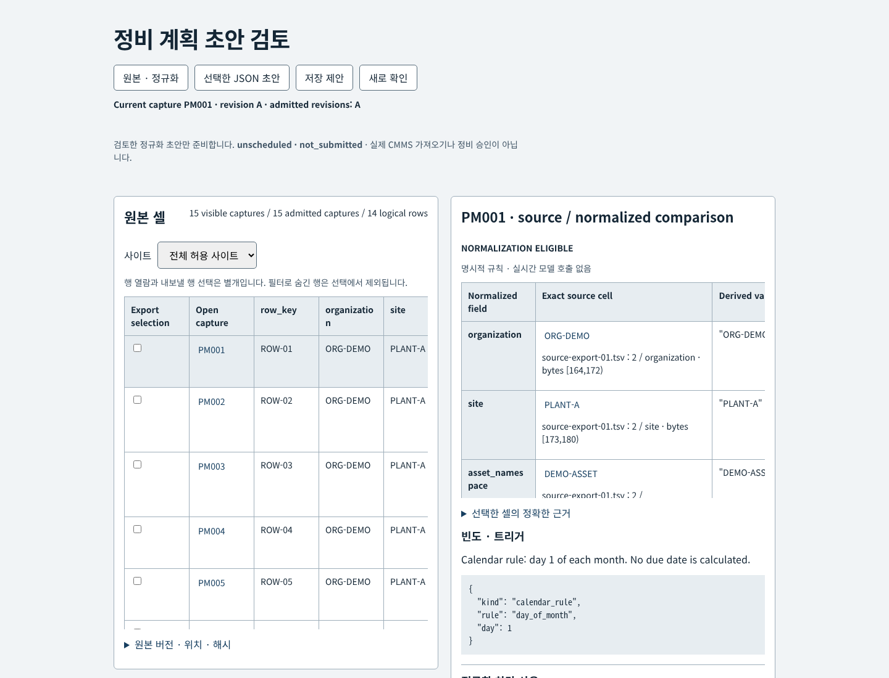
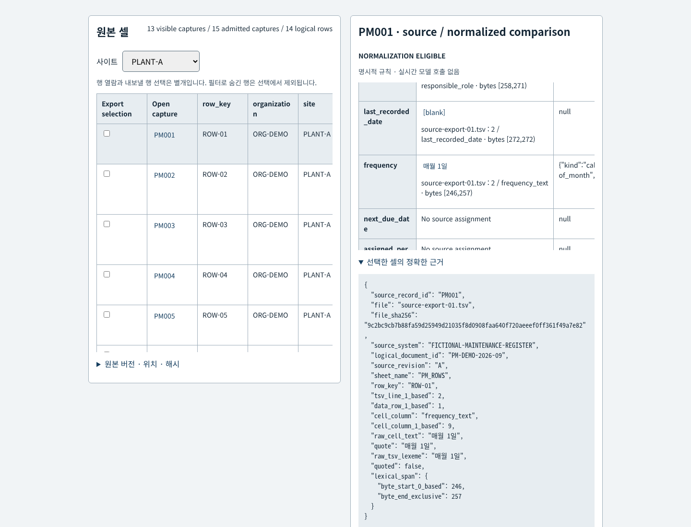
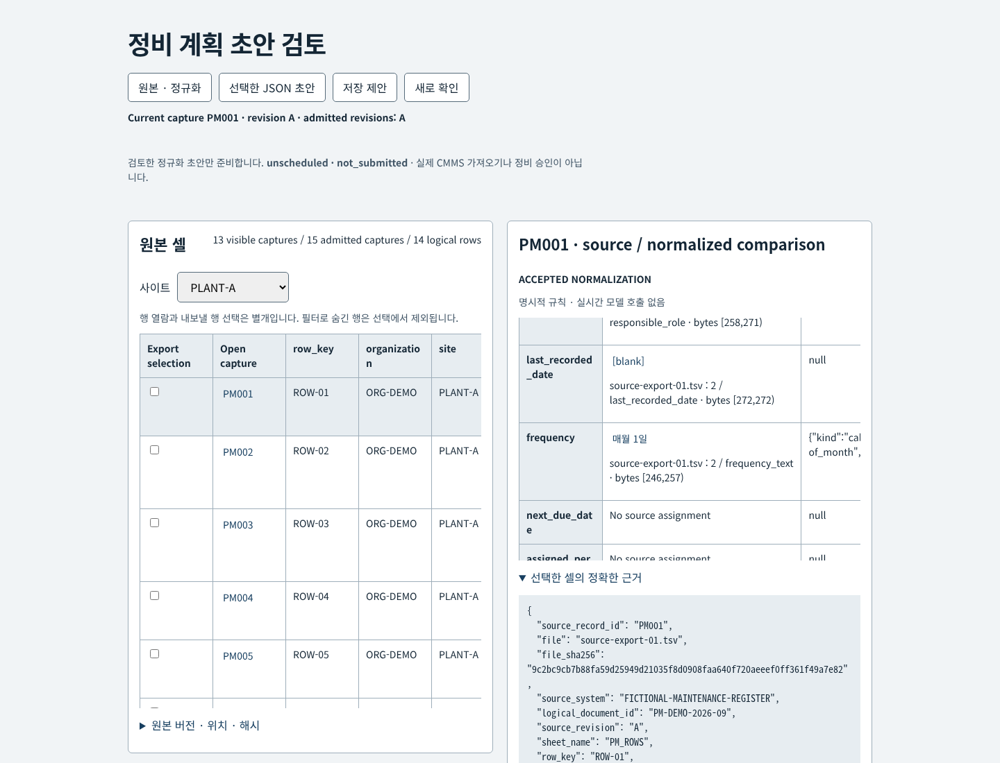
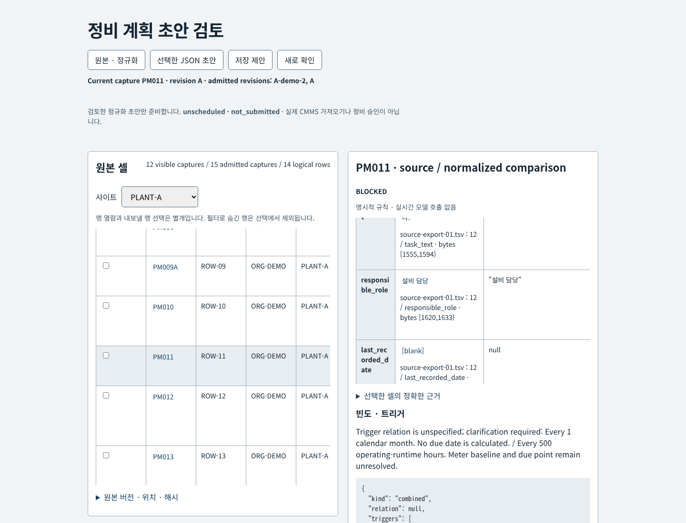
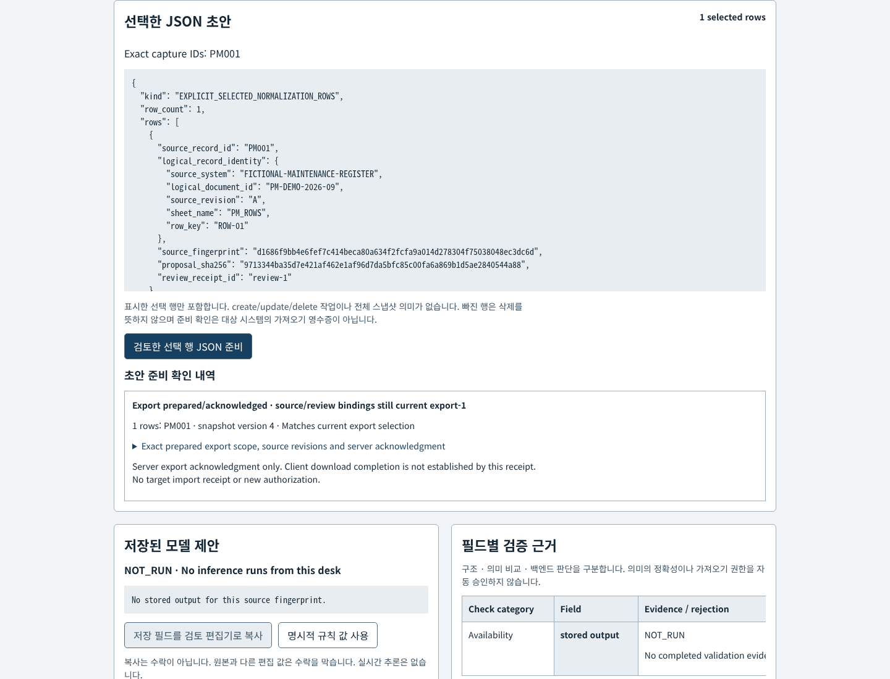
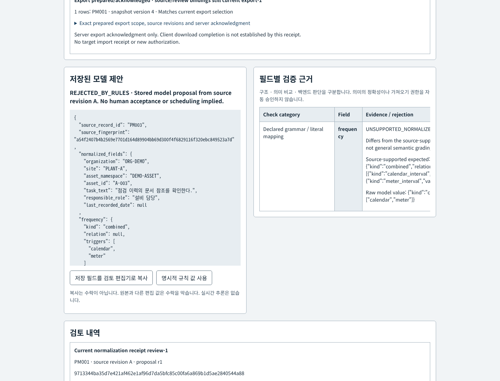
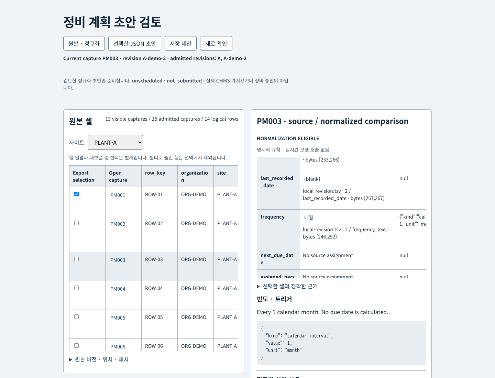
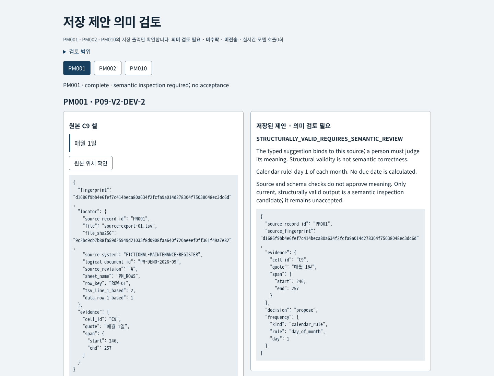
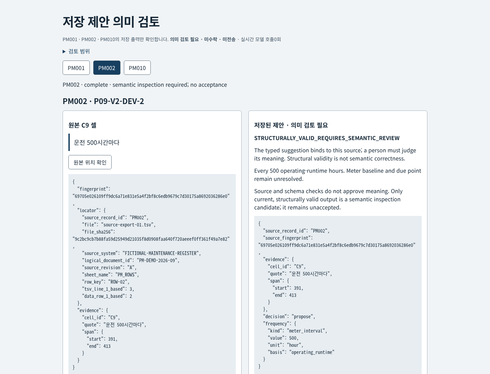
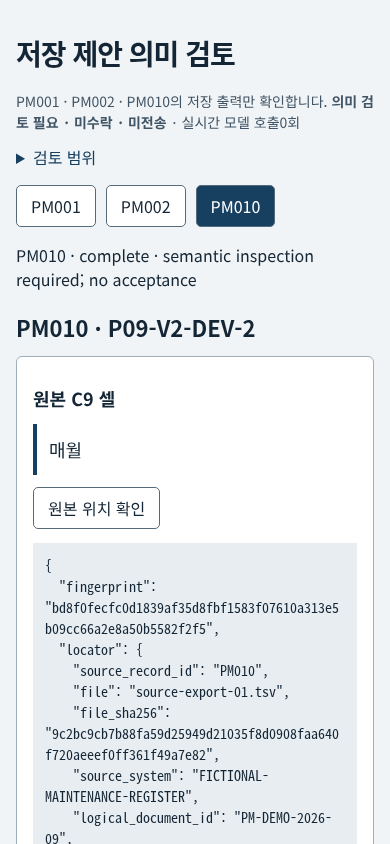

# Maintenance job-plan draft review

[Editable SVG](docs/architecture.svg) · [Original glyph provenance](docs/asset-provenance.md)

A native source-cell grid and field comparison for fictional maintenance-register normalization. Original strings, quoted TSV lexemes, cell byte spans and source hashes sit beside typed calendar, meter and event interpretations. The result is a reviewed JSON draft: every row remains **unscheduled** and **not_submitted**. No Maximo credentials, import, work order or maintenance authorization exists here.


## 현재 기능 화면

승인된 원본/결과 패널 구성을 유지한 CPU 브라우저 화면입니다. 큰 한국어 제목, 동일 폭 흰색 카드와 원본 JSON을 사용하며, 미확정·과거·차단 상태는 계속 표시합니다. 아래 화면과 영상은 추가 추론 없이 기존 원본과 저장 출력을 열어 캡처했습니다.

원본 행을 열고 사이트별로 살펴봅니다. 행 열기와 내보낼 행 선택은 별도 동작입니다.


정규화 필드 옆 원본 셀을 선택하면 정확한 문자열·파일 해시·바이트 위치를 확인합니다.


현재 제안만 검토해 정규화를 수락합니다. 일정·작업 승인이나 CMMS 제출을 뜻하지 않습니다.


모호한 트리거 조합은 차단 사유와 함께 남겨 두며 임의의 whichever-first 관계를 만들지 않습니다.


선택한 정확한 행 ID·개수·원본 버전을 확인하고 JSON 초안을 준비합니다. 준비 확인은 대상 시스템 가져오기 영수증이 아닙니다.


기존 v1 저장 출력의 원문과 필드별 거절 근거를 함께 확인합니다. 구조·의미·백엔드 결정은 별개입니다.


새 원본 리비전을 허용하면 현재 헤더가 바뀌고 과거 모델 출력·검토·초안 확인이 현재 권한을 되살리지 않습니다.


별도 v2 저장 제안 화면은 원본 C9 셀과 미수락 원문 JSON을 나란히 보여 줍니다. 구조 적합성이 의미 정확성을 증명하지 않습니다.


500 운전시간은 달력 시간으로 바꾸지 않습니다. 계기 기준과 실제 도래 시점은 미확정입니다.


390px에서는 두 패널을 순서대로 읽으며 한 줄 제목과 14px 이상 근거 글자를 유지합니다.


[실제 CPU 브라우저 영상](artifacts/ui-refit/review-workflow.mp4) · [실행한 Chrome 검사](artifacts/ui-refit/browser-checks.json) · [새 미디어 SHA256·바이트 출처](artifacts/ui-refit/asset-provenance.json) · [기능 목록](docs/ui-refit-inventory.md). 브라우저 검사는 로컬 Chrome에서 실행했으며 CI에서 실행했다고 주장하지 않습니다. 기존 모델 요청·스키마·출력·평가 파일은 수정하지 않았습니다.

<details><summary>이전 화면과 미디어 · historical</summary>

[이전 원본 셀 화면](artifacts/media/packet-desktop.png) · [이전 390px 화면](artifacts/media/packet-mobile-390.png) · [이전 stale 화면](artifacts/media/packet-stale-review.png) · [이전 실제 영상](artifacts/media/packet-review.mp4) · [이전 v2 화면](artifacts/media/v2-review-ui-desktop.png) · [이전 v2 390px](artifacts/media/v2-review-ui-mobile-390.png). 아래 과거 모델/CPU 결과를 기록한 당시 화면이며 현재 UI를 나타내지 않습니다.

</details>


The original packet was consumer-locally materialized from Library, checked against its 19,602-byte archive SHA256, and frozen unchanged before prompting. Its 15 captures represent 14 logical rows, with three development and twelve evaluation captures. Packet-author consistency checks are not application accuracy. [Integrity receipt](artifacts/packet-integrity.json) · [Original source contract](fixtures/original/maintenance-migration-fixtures-v1/SOURCE-CONTRACT.md) · [Isolated evaluator contract](evaluate-packet.mjs).

**Actual frozen comparison: 12 Qwen calls completed, zero development/retry/demo inference. All 12 model proposals failed rule validation.** Context 4096, output 640, timeout 60 seconds, concurrency 1, temperature 0 and seed 42 were fixed before scoring. Gold stayed outside runtime/model inputs; raw outputs were scored before gating and preserved without repairs or fallback replacement.

| Evaluation measure (12 captures / 11 logical rows) | Explicit rules | Raw Qwen |
|---|---:|---:|
| Exact literal fields | 84/84 | 84/84 |
| Exact typed frequencies | 12/12 | 0/12 |
| Expected blockers detected | 8/8 | 0/8 |
| Blocker false positives / misses | 0 / 0 | 0 / 8 |
| Unsupported normalized top-level values | 0 | 12 |
| Unsafe reviewability declarations | 0 | 8 |
| Automatic / unsafe acceptance | 0 / 0 | 0 / 0 |

All model transports completed with `done:true` / `stop`, and all twelve contents parsed as JSON. Exact citation/source binding passed in every output; that did not make their semantics correct. Frequencies were nonempty malformed objects, including string/raw-valued intervals, omitted relations and wrong trigger structures. The frozen output schema did not require nested typed-frequency properties, a material limitation of this method. These results do not establish Qwen's general capability under another configuration. No prompt, grammar, schema or oracle was tuned after seeing the outputs.

[Baseline results](artifacts/packet-baseline-evaluation.json) · [Raw model results](artifacts/packet-model-evaluation.json) · [All preserved attempts](artifacts/model-attempts) · [Frozen method and limits](docs/experiment.md) · [Completion / safe runtime release](artifacts/runtime-completion.json). The separate development baseline scored 21/21 literal fields and 3/3 frequencies; no development model calls ran. The prototype supports this packet's narrow grammar, not general maintenance extraction, scheduling readiness or measured business savings.

113 Node engineering tests and eleven Linux CPU transport/runner mocks pass, including 18 isolated v2 development-contract checks. Actual Chrome checks cover keyboard/focus, delayed/failing requests, stale two-client decisions, repeated receipts, exact export scope after filtering, stored-model rejection and 390px readability. [Stored-output replay checks](artifacts/stored-model-browser-checks.json) and [video provenance](artifacts/packet-video-provenance.json) distinguish CPU media and automated fictional inspections from inference and human domain adjudication.

[Versioned v2 development contract](development/v2-protocol.md) declares an exact typed proposal/abstention schema and prompt. Its separate CPU desk (`npm run v2:desk`, port 5109) checks structure and exact source spans while requiring human semantic review. The isolated grader uses independently authored labels, so v1's limited vocabulary does not define paraphrase truth. V2 completed its single authorized development batch: PM001, PM002 and PM010 once each, with no retries or demo inference. Raw shape/source/decision/frequency scored 3/3 and frequency leaves 10/10 against original author development labels; no authority fields appeared. Abstention quality and held-out paraphrase generalization were not measured. [Development results and all limits](docs/v2-development-results.md) preserve the exact frozen method and outputs. Raw model output and backend enrichment remain separate. V1 model inputs, normalization/validation contract, original packet, outputs and evaluation remain unchanged; its twelve exposed cases cannot become fresh held-out evidence.

The diagram uses original generic process glyphs. Its dashed Model branch is optional offline comparison and stored-output inspection; the default UI makes no inference calls. The versioned v2 inspection desk records no acceptance or export. [CPU UI repairs and preservation boundaries](docs/ui-maintenance.md) include exact downloaded history, field rejection evidence, source/filter reconciliation and current versus historical revision labels.


## Run

Node 20 or later, no npm dependencies:

```sh
npm test
python3 -m unittest test_model_client.py  # Linux CPU mocks; no network/model
npm start
```

Open `http://127.0.0.1:5089`. The default desk loads only the two allowlisted TSV source exports and public source manifest/contract. `ui/reference-layout/server.mjs` serves the current presentation and delegates every decision API to the unchanged `packet-server.mjs`. `source.mjs`, `normalize.mjs` and `server.mjs` preserve the earlier TSV/JSON scaffold as separate engineering regressions; they are not the packet baseline. [Historical scaffold stage](docs/scaffold-stage.md).

State and fictional reviewer scope are in memory. The synthetic planner has ORG-DEMO / PLANT-A and PLANT-B scope; this is a demonstration policy, not enterprise authentication. Refreshing the process discards local decisions. Binding hashes detect changed content, not identity fraud, and are not digital signatures.

## Normalization and review boundaries

The packet parser validates original UTF-8 bytes and CRLF, manifest hashes, declared headers, quoting and doubled quote escapes. Decoded evidence quotations remain distinct from original lexical spans. Multiline fields, XLSX, merged cells, workbook number formats, macros and formulas are outside this slice. The earlier JSON source utility rejects duplicate keys and numeric identity values. Source links/formulas remain inert strings; the application never follows or executes them.

Logical identity combines source system, logical document, revision, sheet and row key. Payload comparison includes section, organization, site, namespace, asset string, task, frequency, role and recorded date. Capture-local IDs and capture time give no precedence. Same-identity/same-revision differing content is a conflict, including both supplied PM009 captures. `00017` and `17`, and their sites, never collapse. Blank cells are not forward-filled.

The published bounded Korean grammar distinguishes calendar intervals, calendar rules, operating-hour meter intervals and explicit whichever-first combinations. Monthly is not 30 days; meter runtime is not elapsed clock time. Comma-separated triggers have no inferred relation; `필요 시` needs an event. Jan 31 plus three months gets no calculated due date or silently selected month-end convention. `last_recorded_date` is preserved literally, not admitted as a completion/scheduling anchor. [Exact rules and completeness limits](docs/packet-rules.md).

Hard missing identity, task, role or frequency, same-version conflict, unspecified event/relation, formula-like task and unsupported frequency block acceptance. A supported 500-operating-hour normalization can be accepted while meter baseline/current reading/due point remain unknown. Scheduling unknowns are illustrative, not a complete maintenance-readiness checklist. Role labels identify no person and grant no authorization.

Human acceptance binds source file/revision/cells, normalized-content hash, exact proposal hash/revision, source admission generation and fictional reviewer scope. Re-admitting identical historical bytes cannot revive a superseded receipt. Return records a reason; correction can only restore or validate source-supported fields. Unsupported edits require source clarification. Old clicks get 409 and fresh inspection; no automatic re-acceptance. [Preserved development findings](artifacts/packet-development-failures.json).

Opening a row is separate from selecting export rows. The export preview names **every selected capture, logical identity and count**, with current receipt/proposal hashes. Filtering removes hidden rows from selection. Any selected unaccepted, stale or unavailable row blocks the entire export; none is silently omitted. Exported rows carry exact cell evidence and review timestamps. They define no CMMS create/update/delete/full-snapshot semantics; missing rows imply no deletion. A download acknowledgment is local evidence, never a target-system import receipt.

Reads and mutations serialize in each client, server snapshot versions reject stale actions, and exact proposal/scope guards bind review/export. Original-source navigation is keyboard focusable. Rebuilt controls restore focus only when no later explicit choice occurred. Native tables scroll at 390px with meaningful text at least 14px; the viewport does not shrink to fit the grid.

## Optional stored model proposal

`model-input.mjs` builds cell IDs, exact source quotes/spans, logical metadata and related conflicting captures. It supplies no baseline answers, implementation case notes, evaluator gold or scores. `model_client.py` uses only the existing local Qwen runtime after explicit coordinator handover. A shared file lock serializes requests; an HTTP timeout creates a persistent barrier and stops the batch until completion is independently verified. No generated code runs.

The UI can inspect stored outputs without inference. Model proposals stay separate from explicit-rule fields and acceptance. Exact-source/citation/schema/rule checks reject unsupported proposals; a stale source removes the stored candidate and current citation contents. Copying a stored proposal into the editor is inspection only; differing/invalid unsaved fields disable acceptance until explicit restore/validation and fresh inspection. Raw model quality is scored before gating, and workflow correctness is tested separately. No claim of maintenance-SME adjudication, production readiness or general extraction accuracy follows from the small synthetic comparison.

## Business precedent and rights

IBM's named [Quant Service case](https://www.ibm.com/fr-fr/case-studies/quant-service) describes an MVP converting spreadsheet attachments into structured job-plan data with human validation/correction. Its reported 65% reduction in manual work and 30% faster implementation have no disclosed controlled denominator. These are vendor claims about that MVP, not measured P09 benefits or evidence of a full rollout.

The requested [master PM documentation](https://www.ibm.com/docs/en/masv-and-l/maximo-manage/cd?topic=pm-master-preventive-maintenance-records) and [job-plan/work-order documentation](https://www.ibm.com/docs/en/masv-and-l/maximo-manage/cd?topic=overview-job-plans-work-orders) returned HTTP 403 in this research pass; their current text was not verified here. The supplied implementation contract independently distinguishes master templates, actual orders and job-plan site scopes. P09 ends before all target-system operations.

Original code, glyphs and scaffold examples are MIT. The original fictional packet is CC0 with its unchanged [license](fixtures/original/maintenance-migration-fixtures-v1/LICENSE.txt) and [provenance](fixtures/original/maintenance-migration-fixtures-v1/PROVENANCE.json). It is not Quant Service data or IBM private architecture. Deployment needs real identity/access controls, durable tamper-evident audit, domain review, target schemas and import validation; this local prototype provides none of those production services.
