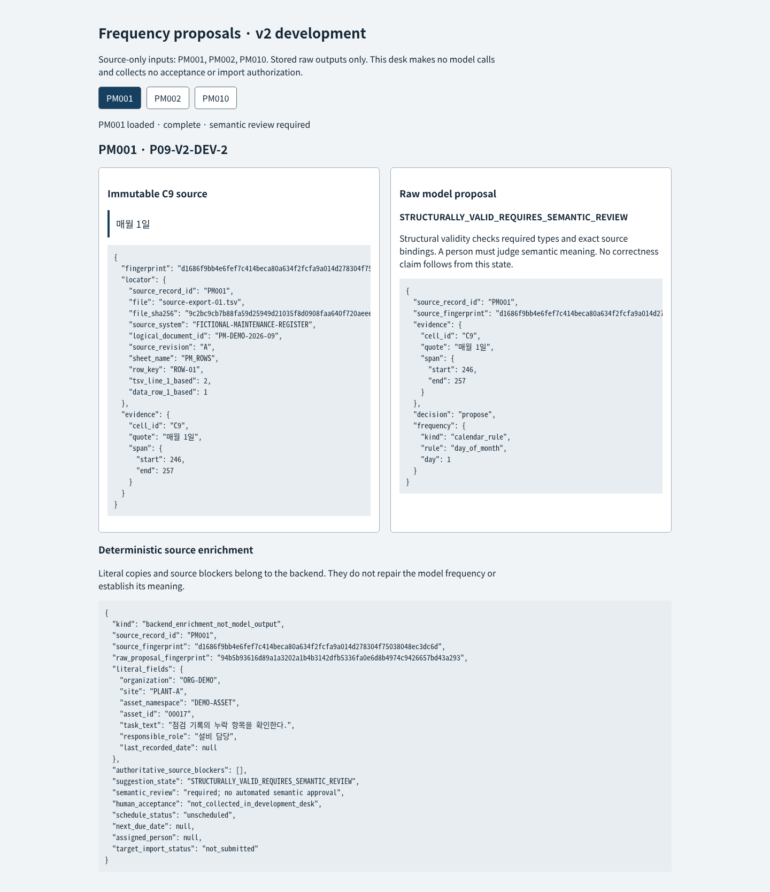

# P09 v2: one frozen three-case development batch

Exactly **three development inference calls**, one each for PM001, PM002 and PM010, ran after sole-GPU handover. No retries, demo inference or new-challenge evaluation calls occurred. The original TSV bytes, author labels, prompt, schema, policy and grader were frozen before prompting. V1's twelve exposed evaluation cases and results remain unchanged.

The method was declared at `09df59544a6691968dd2f9ef3075cfa251acc5d5` and hash-frozen at `1b3bbdbe715ff0b231adcc6b1916940c4674f4af`. [Exact predeclared protocol](../development/v2-protocol.md) · [Freeze](../artifacts/v2-development/freeze.json) · [All raw attempts](../artifacts/v2-development/batch-01/attempts) · [Raw-output score](../artifacts/v2-development/batch-01/score.json).

| Raw model metric | Result |
|---|---:|
| Completed non-length transport / strict content JSON | 3/3 / 3/3 |
| Required typed shape / exact source-span binding | 3/3 / 3/3 |
| Decision / complete typed frequency versus original author development labels | 3/3 / 3/3 |
| Exact canonical primitive frequency leaves | 10/10 |
| Unjustified abstentions / named authority fields | 0 / 0 |
| Required abstention and reason handling | Not measured: 0 labeled abstention cases |

The raw proposals were a day-of-month rule for PM001, an explicit 500 operating-hour meter interval for PM002 and a one-calendar-month interval for PM010. Nothing was repaired, coerced or substituted before scoring. [Backend enrichment](../artifacts/v2-development/batch-01/backend-enrichment.json) is a separate deterministic artifact: its literal copies, source blockers and unscheduled/not_submitted status receive no model credit.

The predeclared development criterion was met. This is a prompt/schema-specific check on **three familiar development inputs**, not a fresh held-out evaluation or evidence of paraphrase generalization. It has no ambiguous/unsupported source examples and does not establish abstention quality, combined-trigger/event accuracy, maintenance-SME approval, scheduling readiness or integration safety. An independently authored new challenge remains separate and has not been run. These cases cannot become new held-out evidence.

The existing runtime was Ollama 0.17.7 / `qwen3:4b`, digest `359d7dd4bcdab3d86b87d73ac27966f4dbb9f5efdfcc75d34a8764a09474fae7`. Context 4096, output 640, timeout 60s, concurrency 1, temperature 0, seed 42, think/stream/truncate/shift false were unchanged. Actual prompt token counts were 1536/1543/1539; generated counts were 170/186/169. All three responses ended with `done:true` / `stop`; this exercised the schema for these three response variants only.

The runner exited, the shared inference lock was reacquired and released, and the timeout marker was absent. [Preflight](../artifacts/v2-development/lease-preflight.json) · [Actual completion and safe lease release](../artifacts/v2-development/batch-01/completion.json). No generated code ran, no model suggestion was automatically accepted, and the v2 desk retains `STRUCTURALLY_VALID_REQUIRES_SEMANTIC_REVIEW` for all three outputs.

The screenshot replays the stored output without additional inference. Actual keyboard, delayed selection/focus and 390px readability checks are recorded in [stored-output browser evidence](../artifacts/v2-development/batch-01/stored-browser-checks.json); the mobile document remained 390px wide with meaningful text at least 14px. A separate synthetic browser response tests the semantic-review label and is not model evidence. [Confirmed Library media identity](../artifacts/v2-development/batch-01/library-media.json) preserves this new screenshot without changing v1 media.
